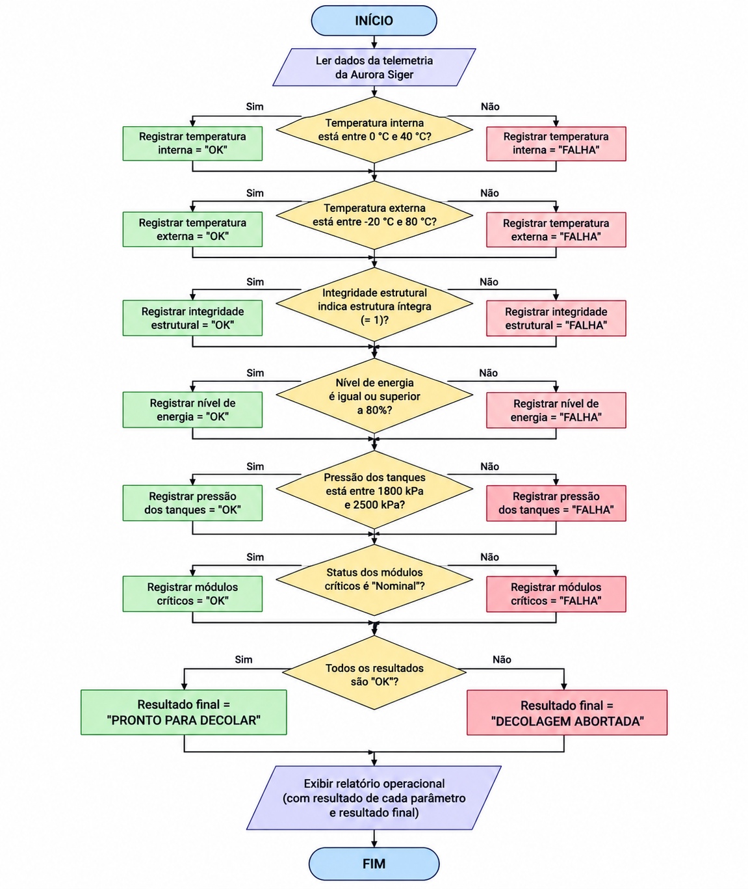
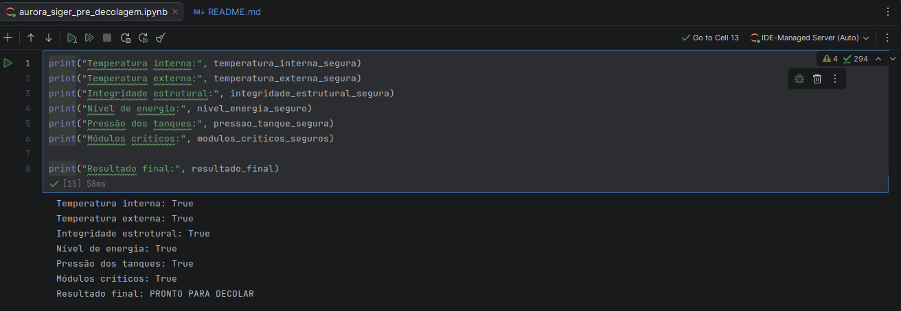
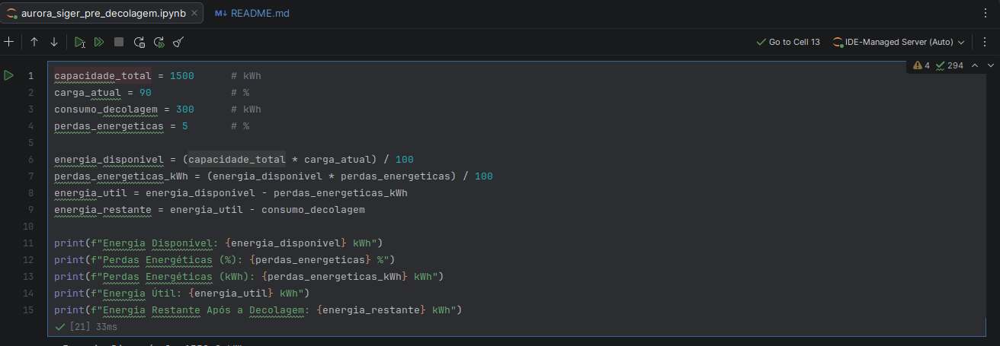

# Aurora Siger — Fase 1

Projeto desenvolvido como parte da Fase 1 da missão **Aurora Siger**, com foco na elaboração de um relatório operacional de pré-decolagem.

A atividade utiliza conceitos de lógica computacional e programação em Python para simular a análise de dados de telemetria, verificar condições de segurança e realizar uma análise energética da espaçonave antes da decolagem.

## Objetivos

O projeto tem como objetivo simular o processo de verificação pré-decolagem da Aurora Siger, contemplando:

- organização e interpretação dos dados de telemetria;
- definição de critérios de segurança para a simulação;
- desenvolvimento da lógica de decisão para autorização ou aborto da decolagem;
- implementação das verificações em Python;
- análise da disponibilidade e do consumo de energia;
- utilização de Inteligência Artificial para análise dos dados e identificação de anomalias;
- reflexão sobre aspectos éticos, sociais e de sustentabilidade relacionados ao projeto.

## Estrutura do repositório

```text
aurora-siger-fase-1/
│
├── README.md
├── .gitignore
│
├── notebook/
│   └── aurora_siger_pre_decolagem.ipynb
│
├── imagens/
│   ├── fluxograma-aurora-siger-fase-1.png
│   ├── resultado_simulacao.png
│   └── resultado_analise_energetica.png
│
├── analises-ia/
│   ├── parecer_gemini.html
│   ├── parecer_claude.html
│   └── parecer_copilot.html
│
└── docs/
    └── relatorio_operacional_pre_decolagem.pdf
```

- **notebook/** — notebook Jupyter contendo a implementação da simulação em Python.
- **imagens/** — imagens, diagramas e evidências de execução utilizados na documentação do projeto.
- **docs/** — relatório final da atividade em formato PDF.
- **analises-ia/** — resultados completos das análises realizadas com as ferramentas de Inteligência Artificial.

## Tecnologias utilizadas

- Python
- Jupyter Notebook
- Git
- GitHub

## Como executar

### Pré-requisitos

Para executar a simulação, é necessário possuir:

- Python 3;
- Jupyter Notebook ou JupyterLab;
- Git, caso o projeto seja obtido por meio da clonagem do repositório.

### Clonando o repositório

Clone este repositório:

```bash
git clone https://github.com/ojuara-renato/aurora-siger-fase-1.git
```

Em seguida, acesse o diretório do projeto:

```bash
cd aurora-siger-fase-1
```

### Executando o notebook

Inicie o Jupyter Notebook:

```bash
jupyter notebook
```

Abra o arquivo:

```text
notebook/aurora_siger_pre_decolagem.ipynb
```

Execute as células do notebook em sequência para realizar a simulação e visualizar os resultados.

> O código desenvolvido utiliza apenas recursos nativos do Python, não sendo necessária a instalação de bibliotecas adicionais para a execução da simulação.

## Fluxograma

O fluxo de decisão utilizado na verificação dos parâmetros de telemetria está representado no diagrama abaixo.



## Resultados da execução

### Verificação dos parâmetros de telemetria

A imagem abaixo apresenta o resultado da execução da verificação dos parâmetros de telemetria. No cenário simulado, todos os parâmetros atenderam aos critérios de segurança estabelecidos, resultando na condição **"PRONTO PARA DECOLAR"**.



### Análise energética

A análise energética considera a capacidade total de energia, a carga atual, as perdas energéticas e o consumo elétrico estimado durante a fase de decolagem.

A imagem abaixo apresenta a execução dos cálculos realizados em Python.



### Análises com Inteligência Artificial

Como parte da atividade, os mesmos cenários de telemetria foram analisados com Google Gemini, Anthropic Claude e Microsoft Copilot. Os resultados completos utilizados na comparação apresentada no relatório estão disponíveis nos arquivos:

- [Google Gemini](analises-ia/parecer_gemini.html)
- [Anthropic Claude](analises-ia/parecer_claude.html)
- [Microsoft Copilot](analises-ia/parecer_copilot.html)

## Documentação

O relatório completo da atividade, contendo o desenvolvimento das etapas, premissas adotadas, algoritmos, análises e considerações finais, está disponível em:

📄 [Relatório Operacional de Pré-Decolagem](docs/relatorio_operacional_pre_decolagem.pdf)

## Autor

**Renato Santiago de Araujo**  
Curso de Ciências da Computação  
FIAP ON — EAD  
Turma: 1º ano • 1CCOS • 2026/2